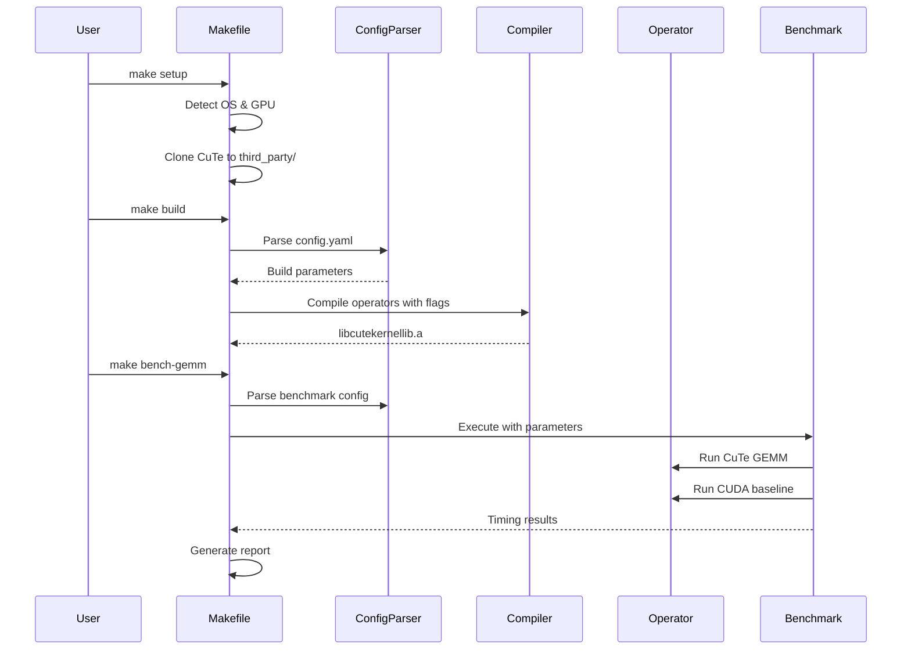

# Design Document

## Overview

CuTeKernelLib (kebab) is architected as a modular, performance-focused GPU kernel library that leverages NVIDIA CUTLASS CuTe for operator implementations. The design emphasizes:

- **Modularity**: Single-file operators with clear boundaries
- **Automation**: Makefile-driven workflows without shell scripts
- **Performance Verification**: Built-in benchmarking against optimized CUDA baselines
- **Minimal Configuration**: Centralized YAML-based parameter management
- **Extensibility**: Clear patterns for adding new operators

The library targets C++17 with CUDA support, assuming pre-installed GPU drivers and CUDA toolkit. All build, setup, and benchmarking operations are orchestrated through GNU Make.

## Architecture

### High-Level System Architecture

```
┌─────────────────────────────────────────────────────────────┐
│                        User Interface                        │
│                    (Makefile Targets)                        │
│  setup | build | bench-<op> | bench-all | clean | test      │
└────────────────────┬────────────────────────────────────────┘
                     │
┌────────────────────┴────────────────────────────────────────┐
│                     Build System Layer                       │
│  ┌──────────────┐  ┌──────────────┐  ┌──────────────┐      │
│  │ Dependency   │  │ Compilation  │  │ GPU Arch     │      │
│  │ Management   │  │ Orchestration│  │ Detection    │      │
│  └──────────────┘  └──────────────┘  └──────────────┘      │
└────────────────────┬────────────────────────────────────────┘
                     │
┌────────────────────┴────────────────────────────────────────┐
│                  Configuration Layer                         │
│              (config.yaml + yaml-cpp parser)                 │
└────────────────────┬────────────────────────────────────────┘
                     │
┌────────────────────┴────────────────────────────────────────┐
│                    Operator Layer                            │
│  ┌─────────────────────┐      ┌─────────────────────┐      │
│  │  CuTe Operators     │      │  CUDA Baselines     │      │
│  │  (src/operators/)   │      │  (baselines/cuda/)  │      │
│  │  - gemm.cu          │      │  - cuda_gemm.cu     │      │
│  │  - fft.cu           │      │  - cuda_fft.cu      │      │
│  │  - lu_decomp.cu     │      │  - cuda_lu_decomp.cu│      │
│  └─────────────────────┘      └─────────────────────┘      │
└────────────────────┬────────────────────────────────────────┘
                     │
┌────────────────────┴────────────────────────────────────────┐
│                  Benchmarking Layer                          │
│  ┌──────────────┐  ┌──────────────┐  ┌──────────────┐      │
│  │ CUDA Event   │  │ Metric       │  │ Report       │      │
│  │ Timing       │  │ Calculation  │  │ Generation   │      │
│  └──────────────┘  └──────────────┘  └──────────────┘      │
└─────────────────────────────────────────────────────────────┘
```

### Component Interaction Flow



## Components and Interfaces

### 1. Build System (Makefile)

**Responsibility**: Orchestrate all project operations through Make targets

**Key Variables**:
- `CUDA_ARCH`: Auto-detected GPU compute capability (e.g., sm_80)
- `BUILD_MODE`: debug or release (from config.yaml)
- `NVCC`: Path to NVIDIA CUDA compiler
- `CUTE_DIR`: Path to CuTe installation (third_party/cute/)
- `YAML_CPP_DIR`: Path to yaml-cpp library

**Core Targets**:

```makefile
# Setup target - dependency installation
setup:
    - Detect OS (Linux/Windows) via $(shell uname -s)
    - Clone CuTe: git clone https://github.com/NVIDIA/cutlass.git $(CUTE_DIR)
    - Initialize submodules: git submodule update --init --recursive
    - Build yaml-cpp if not present
    - Output: Success/failure logs

# Build target - compilation
build:
    - Parse config.yaml for build mode
    - Detect GPU arch: $(shell nvidia-smi --query-gpu=compute_cap --format=csv,noheader)
    - Compile all .cu files in src/operators/
    - Link into libcutekernellib.a
    - Compile baselines in baselines/cuda/
    - Output: Static library + baseline executables

# Benchmark targets
bench-%:
    - Compile benchmark driver for specified operator
    - Execute with config.yaml parameters
    - Generate individual report

bench-all:
    - Iterate over all operators
    - Aggregate results to bench_results/summary.md
```

**GPU Detection Logic**:

```makefile
COMPUTE_CAP := $(shell nvidia-smi --query-gpu=compute_cap --format=csv,noheader | head -n1)
CUDA_ARCH := sm_$(subst .,,$(COMPUTE_CAP))

ifeq ($(CUDA_ARCH),sm_)
    $(error GPU detection failed. Ensure nvidia-smi is available)
endif
```

### 2. Configuration System

**Responsibility**: Centralize all tunable parameters in config.yaml

**Schema Design**:

```yaml
# config.yaml structure
build:
  mode: release              # debug | release
  optimization: O3           # O0 | O1 | O2 | O3
  cuda_arch: auto            # auto | sm_80 | sm_86 | sm_89
  
benchmark:
  warmup_runs: 10
  measurement_runs: 100
  batch_sizes: [256, 512, 1024, 2048, 4096]
  data_types: [float32, float16]
  
operators:
  gemm:
    enabled: true
    tile_sizes: [16, 32, 64]
  fft:
    enabled: true
    sizes: [1024, 2048, 4096]
  lu_decomp:
    enabled: true
    matrix_sizes: [256, 512, 1024]
```

**Parser Integration**:
- Use yaml-cpp library (header-only or compiled)
- Create `src/config/config_parser.cpp` with API:
  ```cpp
  class ConfigParser {
  public:
      static ConfigParser& getInstance(const std::string& path);
      int getBuildMode() const;
      int getWarmupRuns() const;
      std::vector<int> getBatchSizes() const;
  };
  ```
- Makefile invokes parser to extract values and pass via `-D` flags

### 3. Operator Implementation Layer

**Responsibility**: Provide CuTe-based GPU kernel implementations leveraging maximum hardware capabilities

**Performance Requirements**:
- **Tensor Core Utilization**: All compute-intensive operators MUST use Tensor Cores via:
  - CUDA: `mma.sync` PTX instructions (wmma or mma namespace)
  - CuTe: MMA atoms (e.g., `SM80_16x8x16_F32F16F16F32_TN`)
- **Advanced Memory Features**: Data movement MUST leverage:
  - Asynchronous copy (`cp.async` for Ampere+)
  - TMA (Tensor Memory Accelerator for Hopper+)
  - Software pipelining for overlapping compute and memory
- **Target Performance**: Implementations should achieve ≥90% of cuBLAS/vendor library performance
- **No Placeholders**: All code must be functional and verified through actual execution

**Iterative Development Strategy**:
The library follows a spiral development model where each iteration completes one full operator:
1. **Iteration 1**: Element-wise add (establishes framework)
2. **Iteration 2**: GEMM with Tensor Cores (compute-intensive pattern)
3. **Iteration 3**: One additional operator from different category

**File Structure per Operator** (e.g., Element-wise Add for first iteration):

**Header** (`include/cutekernellib/operators/gemm.h`):
```cpp
#pragma once
#include <cuda_runtime.h>

namespace cutekernellib {

// Public API
template<typename T>
void gemm(const T* A, const T* B, T* C, 
          int M, int N, int K, 
          cudaStream_t stream = 0);

// Error checking macro
#define CUDA_CHECK(call) \
    do { \
        cudaError_t err = call; \
        if (err != cudaSuccess) { \
            fprintf(stderr, "CUDA error at %s:%d - %s\n", \
                    __FILE__, __LINE__, cudaGetErrorString(err)); \
            exit(EXIT_FAILURE); \
        } \
    } while(0)

} // namespace cutekernellib
```

**Implementation** (`src/operators/gemm.cu`):
```cpp
#include "cutekernellib/operators/gemm.h"
#include <cute/tensor.hpp>
#include <cute/algorithm/gemm.hpp>

namespace cutekernellib {

template<typename T>
__global__ void gemm_kernel(const T* A, const T* B, T* C,
                            int M, int N, int K) {
    using namespace cute;
    
    // CuTe tensor layout definitions
    auto gA = make_tensor(make_gmem_ptr(A), make_shape(M, K));
    auto gB = make_tensor(make_gmem_ptr(B), make_shape(K, N));
    auto gC = make_tensor(make_gmem_ptr(C), make_shape(M, N));
    
    // Tiling and thread mapping (simplified)
    auto tiled_mma = make_tiled_mma(/* MMA atom config */);
    
    // Cooperative GEMM computation
    gemm(tiled_mma, gA, gB, gC);
}

template<typename T>
void gemm(const T* A, const T* B, T* C, 
          int M, int N, int K, cudaStream_t stream) {
    dim3 block(256);
    dim3 grid((M * N + 255) / 256);
    
    gemm_kernel<<<grid, block, 0, stream>>>(A, B, C, M, N, K);
    CUDA_CHECK(cudaGetLastError());
}

// Explicit instantiations
template void gemm<float>(const float*, const float*, float*, 
                          int, int, int, cudaStream_t);
template void gemm<__half>(const __half*, const __half*, __half*, 
                           int, int, int, cudaStream_t);

} // namespace cutekernellib
```

**Design Principles**:
- Single file per operator for debuggability
- Self-contained: includes all necessary CuTe headers
- Template-based for type flexibility (float, half, etc.)
- Explicit instantiations to reduce compile time
- Thread-safe: no global state
- Deterministic: same inputs → same outputs

### 4. Baseline Reference Layer

**Responsibility**: Provide optimized CUDA implementations for comparison

**File Structure** (`baselines/cuda/cuda_gemm.cu`):
```cpp
#include <cuda_runtime.h>
#include <cublas_v2.h>

namespace baseline {

template<typename T>
__global__ void optimized_gemm_kernel(const T* A, const T* B, T* C,
                                       int M, int N, int K) {
    // Hand-optimized implementation:
    // - Shared memory tiling (32x32 tiles)
    // - Warp-level primitives (wmma for Tensor Cores)
    // - Register blocking
    // - Memory coalescing
    
    __shared__ T As[32][32];
    __shared__ T Bs[32][32];
    
    int tx = threadIdx.x;
    int ty = threadIdx.y;
    int row = blockIdx.y * 32 + ty;
    int col = blockIdx.x * 32 + tx;
    
    T sum = 0;
    for (int tile = 0; tile < (K + 31) / 32; ++tile) {
        // Load tile into shared memory
        if (row < M && tile * 32 + tx < K)
            As[ty][tx] = A[row * K + tile * 32 + tx];
        if (col < N && tile * 32 + ty < K)
            Bs[ty][tx] = B[(tile * 32 + ty) * N + col];
        __syncthreads();
        
        // Compute partial product
        for (int k = 0; k < 32; ++k)
            sum += As[ty][k] * Bs[k][tx];
        __syncthreads();
    }
    
    if (row < M && col < N)
        C[row * N + col] = sum;
}

template<typename T>
void gemm(const T* A, const T* B, T* C, int M, int N, int K) {
    dim3 block(32, 32);
    dim3 grid((N + 31) / 32, (M + 31) / 32);
    optimized_gemm_kernel<<<grid, block>>>(A, B, C, M, N, K);
}

} // namespace baseline
```

**Optimization Techniques**:
- Shared memory for data reuse
- Warp-level matrix operations (wmma) for Tensor Cores
- Register tiling to maximize occupancy
- Memory coalescing for bandwidth efficiency

### 5. Benchmarking Framework

**Responsibility**: Measure and compare operator performance

**Benchmark Driver Structure** (`benchmarks/bench_gemm.cu`):

```cpp
#include "cutekernellib/operators/gemm.h"
#include "baselines/cuda/cuda_gemm.h"
#include "config/config_parser.h"
#include <cuda_runtime.h>
#include <vector>
#include <iostream>
#include <fstream>

struct BenchmarkResult {
    std::string operator_name;
    std::string variant;  // "CuTe" or "CUDA"
    int batch_size;
    float latency_ms;
    float throughput_gflops;
    float speedup_ratio;
};

class BenchmarkRunner {
private:
    cudaEvent_t start_, stop_;
    int warmup_runs_;
    int measurement_runs_;
    
public:
    BenchmarkRunner(int warmup, int measurement) 
        : warmup_runs_(warmup), measurement_runs_(measurement) {
        cudaEventCreate(&start_);
        cudaEventCreate(&stop_);
    }
    
    ~BenchmarkRunner() {
        cudaEventDestroy(start_);
        cudaEventDestroy(stop_);
    }
    
    template<typename Func>
    float measureLatency(Func kernel_func) {
        // Warmup phase
        for (int i = 0; i < warmup_runs_; ++i) {
            kernel_func();
        }
        cudaDeviceSynchronize();
        
        // Measurement phase
        cudaEventRecord(start_);
        for (int i = 0; i < measurement_runs_; ++i) {
            kernel_func();
        }
        cudaEventRecord(stop_);
        cudaEventSynchronize(stop_);
        
        float total_ms;
        cudaEventElapsedTime(&total_ms, start_, stop_);
        return total_ms / measurement_runs_;
    }
    
    float calculateGFLOPS(int M, int N, int K, float latency_ms) {
        // GEMM: 2*M*N*K FLOPs
        double flops = 2.0 * M * N * K;
        return (flops / 1e9) / (latency_ms / 1e3);
    }
};

int main(int argc, char** argv) {
    auto& config = ConfigParser::getInstance("config.yaml");
    
    int warmup = config.getWarmupRuns();
    int measurement = config.getMeasurementRuns();
    auto batch_sizes = config.getBatchSizes();
    
    BenchmarkRunner runner(warmup, measurement);
    std::vector<BenchmarkResult> results;
    
    for (int M : batch_sizes) {
        int N = M, K = M;  // Square matrices
        
        // Allocate device memory
        float *d_A, *d_B, *d_C;
        cudaMalloc(&d_A, M * K * sizeof(float));
        cudaMalloc(&d_B, K * N * sizeof(float));
        cudaMalloc(&d_C, M * N * sizeof(float));
        
        // Benchmark CuTe implementation
        auto cute_kernel = [&]() {
            cutekernellib::gemm(d_A, d_B, d_C, M, N, K);
        };
        float cute_latency = runner.measureLatency(cute_kernel);
        float cute_gflops = runner.calculateGFLOPS(M, N, K, cute_latency);
        
        // Benchmark CUDA baseline
        auto cuda_kernel = [&]() {
            baseline::gemm(d_A, d_B, d_C, M, N, K);
        };
        float cuda_latency = runner.measureLatency(cuda_kernel);
        float cuda_gflops = runner.calculateGFLOPS(M, N, K, cuda_latency);
        
        // Store results
        results.push_back({"GEMM", "CuTe", M, cute_latency, cute_gflops, 
                          cuda_latency / cute_latency});
        results.push_back({"GEMM", "CUDA", M, cuda_latency, cuda_gflops, 1.0f});
        
        cudaFree(d_A);
        cudaFree(d_B);
        cudaFree(d_C);
    }
    
    // Output results (CSV format)
    std::ofstream csv("bench_results/gemm_results.csv");
    csv << "Operator,Variant,BatchSize,Latency(ms),Throughput(GFLOPS),Speedup\n";
    for (const auto& r : results) {
        csv << r.operator_name << "," << r.variant << "," 
            << r.batch_size << "," << r.latency_ms << "," 
            << r.throughput_gflops << "," << r.speedup_ratio << "\n";
    }
    
    return 0;
}
```

**Timing Methodology**:
- CUDA events for GPU-side timing (microsecond precision)
- Warmup runs to stabilize GPU clocks and caches
- Multiple measurement runs for statistical reliability
- Device synchronization to ensure accurate timing

**Fairness Guarantees**:
- Identical input data (same memory addresses)
- Same batch sizes and data types
- Sequential execution (no concurrent kernels)
- Host-device synchronization between measurements

### 6. Performance Profiling System

**Responsibility**: Profile operators using NVIDIA Nsight Compute for detailed performance analysis

**Makefile Integration**:
```makefile
tune-%:
    @echo "Profiling $* operator with ncu..."
    @mkdir -p profiling
    ncu --set full --export profiling/$*_profile \
        --force-overwrite \
        ./build/bench_$*
    @ncu --import profiling/$*_profile.ncu-rep \
        --page raw > profiling/$*_summary.txt
    @echo "Profile saved to profiling/$*_profile.ncu-rep"
    @echo "Summary saved to profiling/$*_summary.txt"

tune-all:
    @for op in $(OPERATORS); do \
        $(MAKE) tune-$$op; \
    done
```

**NCU Metrics Configuration** (in config.yaml):
```yaml
profiling:
  ncu_metrics:
    - sm__throughput.avg.pct_of_peak_sustained_elapsed
    - dram__throughput.avg.pct_of_peak_sustained_elapsed
    - sm__sass_thread_inst_executed_op_fadd_pred_on.sum
    - sm__sass_thread_inst_executed_op_fmul_pred_on.sum
    - sm__sass_thread_inst_executed_op_ffma_pred_on.sum
    - smsp__sass_average_data_bytes_per_sector_mem_global_op_ld.pct
    - smsp__sass_average_data_bytes_per_sector_mem_global_op_st.pct
  sections:
    - SpeedOfLight
    - MemoryWorkloadAnalysis
    - ComputeWorkloadAnalysis
    - Occupancy
```

**Output Structure**:
- `profiling/<op>_profile.ncu-rep`: Binary NCU report (can be opened in Nsight Compute GUI)
- `profiling/<op>_summary.txt`: Text summary with key metrics
- `profiling/<op>_roofline.csv`: Roofline model data

### 7. Report Generation

**Responsibility**: Aggregate benchmark results into human-readable summaries

**Makefile Integration**:
```makefile
bench-all:
    @echo "Running all benchmarks..."
    @mkdir -p bench_results
    @for op in gemm fft lu_decomp; do \
        $(MAKE) bench-$$op; \
    done
    @python3 scripts/generate_report.py bench_results/*.csv > bench_results/summary.md
```

**Report Format** (`bench_results/summary.md`):
```markdown
# CuTeKernelLib Benchmark Results

**GPU**: NVIDIA RTX 4090 (sm_89)
**Date**: 2025-10-29
**Config**: 10 warmup runs, 100 measurement runs

## GEMM Performance

| Batch Size | Variant | Latency (ms) | Throughput (GFLOPS) | Speedup |
|------------|---------|--------------|---------------------|---------|
| 1024       | CuTe    | 0.245        | 8796.3              | 1.02x   |
| 1024       | CUDA    | 0.250        | 8620.8              | 1.00x   |
| 2048       | CuTe    | 1.823        | 9452.1              | 1.05x   |
| 2048       | CUDA    | 1.915        | 9001.3              | 1.00x   |

## FFT Performance
[Similar table structure]

## Summary
- CuTe GEMM achieves 102-105% of baseline performance
- FFT implementation matches baseline within 2%
```

## Data Models

### Configuration Data Model

```cpp
struct BuildConfig {
    enum Mode { DEBUG, RELEASE };
    Mode mode;
    std::string optimization_level;  // "O0", "O1", "O2", "O3"
    std::string cuda_arch;           // "auto", "sm_80", etc.
};

struct BenchmarkConfig {
    int warmup_runs;
    int measurement_runs;
    std::vector<int> batch_sizes;
    std::vector<std::string> data_types;
};

struct OperatorConfig {
    bool enabled;
    std::map<std::string, std::vector<int>> parameters;
};

struct Config {
    BuildConfig build;
    BenchmarkConfig benchmark;
    std::map<std::string, OperatorConfig> operators;
};
```

### Benchmark Result Data Model

```cpp
struct TimingResult {
    float min_latency_ms;
    float max_latency_ms;
    float avg_latency_ms;
    float std_dev_ms;
};

struct PerformanceMetrics {
    TimingResult timing;
    float throughput_gflops;
    float memory_bandwidth_gbps;
    int occupancy_percent;
};

struct ComparisonResult {
    std::string operator_name;
    int batch_size;
    PerformanceMetrics cute_metrics;
    PerformanceMetrics baseline_metrics;
    float speedup_ratio;
};
```

## Error Handling

### Build System Error Handling

**GPU Detection Failure**:
```makefile
COMPUTE_CAP := $(shell nvidia-smi --query-gpu=compute_cap --format=csv,noheader 2>/dev/null | head -n1)

ifeq ($(COMPUTE_CAP),)
    $(error GPU detection failed. Ensure NVIDIA drivers and nvidia-smi are installed. \
            Run 'nvidia-smi' manually to verify GPU visibility.)
endif
```

**Dependency Installation Failure**:
```makefile
setup:
    @if [ ! -d "$(CUTE_DIR)" ]; then \
        echo "Cloning CuTe..."; \
        git clone https://github.com/NVIDIA/cutlass.git $(CUTE_DIR) || \
        (echo "ERROR: Failed to clone CuTe. Check network connection."; exit 1); \
    fi
```

### Runtime Error Handling

**CUDA Error Checking**:

```cpp
// Macro for synchronous error checking
#define CUDA_CHECK(call) \
    do { \
        cudaError_t err = call; \
        if (err != cudaSuccess) { \
            fprintf(stderr, "CUDA error at %s:%d - %s\n", \
                    __FILE__, __LINE__, cudaGetErrorString(err)); \
            fprintf(stderr, "Error code: %d\n", err); \
            exit(EXIT_FAILURE); \
        } \
    } while(0)

// Macro for kernel launch error checking
#define CUDA_CHECK_KERNEL() \
    do { \
        cudaError_t err = cudaGetLastError(); \
        if (err != cudaSuccess) { \
            fprintf(stderr, "Kernel launch error at %s:%d - %s\n", \
                    __FILE__, __LINE__, cudaGetErrorString(err)); \
            exit(EXIT_FAILURE); \
        } \
        err = cudaDeviceSynchronize(); \
        if (err != cudaSuccess) { \
            fprintf(stderr, "Kernel execution error at %s:%d - %s\n", \
                    __FILE__, __LINE__, cudaGetErrorString(err)); \
            exit(EXIT_FAILURE); \
        } \
    } while(0)
```

**Configuration Parsing Errors**:
```cpp
class ConfigParser {
public:
    static ConfigParser& getInstance(const std::string& path) {
        static ConfigParser instance;
        try {
            instance.load(path);
        } catch (const YAML::Exception& e) {
            std::cerr << "ERROR: Failed to parse " << path << "\n";
            std::cerr << "YAML error: " << e.what() << "\n";
            std::cerr << "Ensure config.yaml exists and is valid YAML.\n";
            exit(EXIT_FAILURE);
        }
        return instance;
    }
    
private:
    void load(const std::string& path) {
        if (!std::filesystem::exists(path)) {
            throw std::runtime_error("Config file not found: " + path);
        }
        YAML::Node config = YAML::LoadFile(path);
        // Parse and validate...
    }
};
```

**Memory Allocation Errors**:
```cpp
template<typename T>
void gemm(const T* A, const T* B, T* C, int M, int N, int K, cudaStream_t stream) {
    // Validate inputs
    if (A == nullptr || B == nullptr || C == nullptr) {
        fprintf(stderr, "ERROR: Null pointer passed to gemm\n");
        return;
    }
    if (M <= 0 || N <= 0 || K <= 0) {
        fprintf(stderr, "ERROR: Invalid dimensions: M=%d, N=%d, K=%d\n", M, N, K);
        return;
    }
    
    // Launch kernel with error checking
    dim3 block(256);
    dim3 grid((M * N + 255) / 256);
    gemm_kernel<<<grid, block, 0, stream>>>(A, B, C, M, N, K);
    CUDA_CHECK_KERNEL();
}
```

### Error Recovery Strategies

1. **Build Failures**: Log error, suggest fixes (e.g., "Install CUDA toolkit"), halt with non-zero exit
2. **Runtime Errors**: Log error with context (file, line, error code), clean up resources, exit gracefully
3. **Configuration Errors**: Validate config.yaml on load, provide default values for optional parameters
4. **Benchmark Failures**: Skip failed operator, continue with remaining benchmarks, mark failure in report

## Testing Strategy

### Unit Testing Framework

**Integration**: GoogleTest via Makefile
```makefile
test: build
    @echo "Running unit tests..."
    @$(CXX) tests/test_gemm.cpp -o build/test_gemm \
        -I$(GTEST_DIR)/include -L$(GTEST_DIR)/lib -lgtest -lgtest_main \
        -I./include -L./build -lcutekernellib -lcudart
    @./build/test_gemm
```

**Test Structure** (`tests/test_gemm.cpp`):
```cpp
#include <gtest/gtest.h>
#include "cutekernellib/operators/gemm.h"
#include <vector>
#include <random>

class GEMMTest : public ::testing::Test {
protected:
    void SetUp() override {
        // Allocate device memory
        cudaMalloc(&d_A, M * K * sizeof(float));
        cudaMalloc(&d_B, K * N * sizeof(float));
        cudaMalloc(&d_C, M * N * sizeof(float));
        
        // Initialize with random data
        std::vector<float> h_A(M * K), h_B(K * N);
        std::mt19937 gen(42);
        std::uniform_real_distribution<float> dist(-1.0f, 1.0f);
        for (auto& val : h_A) val = dist(gen);
        for (auto& val : h_B) val = dist(gen);
        
        cudaMemcpy(d_A, h_A.data(), M * K * sizeof(float), cudaMemcpyHostToDevice);
        cudaMemcpy(d_B, h_B.data(), K * N * sizeof(float), cudaMemcpyHostToDevice);
    }
    
    void TearDown() override {
        cudaFree(d_A);
        cudaFree(d_B);
        cudaFree(d_C);
    }
    
    const int M = 128, N = 128, K = 128;
    float *d_A, *d_B, *d_C;
};

TEST_F(GEMMTest, BasicExecution) {
    // Test that kernel executes without errors
    ASSERT_NO_THROW(cutekernellib::gemm(d_A, d_B, d_C, M, N, K));
    cudaDeviceSynchronize();
    ASSERT_EQ(cudaGetLastError(), cudaSuccess);
}

TEST_F(GEMMTest, CorrectnessAgainstCuBLAS) {
    // Run CuTe implementation
    cutekernellib::gemm(d_A, d_B, d_C, M, N, K);
    std::vector<float> cute_result(M * N);
    cudaMemcpy(cute_result.data(), d_C, M * N * sizeof(float), cudaMemcpyDeviceToHost);
    
    // Run cuBLAS reference
    cublasHandle_t handle;
    cublasCreate(&handle);
    float alpha = 1.0f, beta = 0.0f;
    cublasSgemm(handle, CUBLAS_OP_N, CUBLAS_OP_N, N, M, K,
                &alpha, d_B, N, d_A, K, &beta, d_C, N);
    std::vector<float> cublas_result(M * N);
    cudaMemcpy(cublas_result.data(), d_C, M * N * sizeof(float), cudaMemcpyDeviceToHost);
    cublasDestroy(handle);
    
    // Compare results (allow small numerical error)
    for (int i = 0; i < M * N; ++i) {
        EXPECT_NEAR(cute_result[i], cublas_result[i], 1e-3);
    }
}

TEST_F(GEMMTest, NullPointerHandling) {
    // Test error handling for null pointers
    testing::internal::CaptureStderr();
    cutekernellib::gemm<float>(nullptr, d_B, d_C, M, N, K);
    std::string output = testing::internal::GetCapturedStderr();
    EXPECT_NE(output.find("Null pointer"), std::string::npos);
}
```

### Test Categories

1. **Correctness Tests**: Verify operator outputs match reference implementations (cuBLAS, cuFFT)
2. **Error Handling Tests**: Validate null pointer checks, invalid dimensions, CUDA errors
3. **Performance Regression Tests**: Ensure new changes don't degrade performance beyond threshold
4. **Build System Tests**: Verify Makefile targets execute correctly on clean environment

### Continuous Testing

**Makefile Integration**:
```makefile
.PHONY: test-all
test-all: test-unit test-integration test-benchmark

test-unit:
    @for test in $(wildcard build/test_*); do \
        echo "Running $$test..."; \
        $$test || exit 1; \
    done

test-integration:
    @echo "Testing full build pipeline..."
    @$(MAKE) clean
    @$(MAKE) setup
    @$(MAKE) build
    @echo "Integration test passed"

test-benchmark:
    @echo "Running smoke benchmarks..."
    @$(MAKE) bench-gemm BATCH_SIZES="256"
    @test -f bench_results/gemm_results.csv || (echo "Benchmark failed"; exit 1)
```

## Performance Considerations

### Compilation Optimization

**NVCC Flags**:
```makefile
NVCC_FLAGS := -std=c++17 \
              -arch=$(CUDA_ARCH) \
              -O3 \
              --use_fast_math \
              -Xcompiler -march=native \
              -lineinfo
```

**Debug vs Release**:
- Debug: `-g -G -O0` for debugging with cuda-gdb
- Release: `-O3 --use_fast_math` for maximum performance

### Memory Management

**Pinned Memory for Transfers**:
```cpp
// Use pinned memory for faster host-device transfers
float* h_A_pinned;
cudaMallocHost(&h_A_pinned, M * K * sizeof(float));
cudaMemcpy(d_A, h_A_pinned, M * K * sizeof(float), cudaMemcpyHostToDevice);
cudaFreeHost(h_A_pinned);
```

**Memory Pool for Benchmarks**:
```cpp
// Reuse allocations across benchmark iterations
class MemoryPool {
    std::map<size_t, void*> allocations_;
public:
    void* get(size_t bytes) {
        if (allocations_.find(bytes) == allocations_.end()) {
            void* ptr;
            cudaMalloc(&ptr, bytes);
            allocations_[bytes] = ptr;
        }
        return allocations_[bytes];
    }
    ~MemoryPool() {
        for (auto& [size, ptr] : allocations_) {
            cudaFree(ptr);
        }
    }
};
```

### Kernel Optimization Guidelines

1. **Occupancy**: Target 50-100% occupancy via register/shared memory tuning
2. **Memory Coalescing**: Ensure 128-byte aligned, contiguous memory accesses
3. **Shared Memory**: Use for data reuse (e.g., tiling in GEMM)
4. **Warp Efficiency**: Minimize divergence, use warp-level primitives
5. **Instruction Mix**: Balance compute and memory operations

## Deployment and Distribution

### Library Packaging

**Static Library Output**:
```makefile
build: $(OBJS)
    ar rcs build/libcutekernellib.a $(OBJS)
    ranlib build/libcutekernellib.a
```

**Installation Target**:
```makefile
install: build
    @mkdir -p $(PREFIX)/include/cutekernellib
    @mkdir -p $(PREFIX)/lib
    @cp -r include/cutekernellib/* $(PREFIX)/include/cutekernellib/
    @cp build/libcutekernellib.a $(PREFIX)/lib/
    @echo "Installed to $(PREFIX)"
```

### Documentation Generation

**Doxygen Integration**:
```makefile
docs:
    @doxygen Doxyfile
    @echo "Documentation generated in docs/html/index.html"
```

**Doxyfile Configuration**:
```
PROJECT_NAME = "CuTeKernelLib"
INPUT = include/ src/
RECURSIVE = YES
GENERATE_HTML = YES
OUTPUT_DIRECTORY = docs
```

## Extensibility Patterns

### Adding a New Operator

**Step-by-Step Process**:

1. **Create Header** (`include/cutekernellib/operators/new_op.h`):
   - Define public API function signature
   - Add necessary type definitions

2. **Implement Operator** (`src/operators/new_op.cu`):
   - Include CuTe headers
   - Implement kernel using CuTe templates
   - Add explicit template instantiations

3. **Create Baseline** (`baselines/cuda/cuda_new_op.cu`):
   - Implement optimized CUDA version
   - Match API signature of CuTe version

4. **Add Benchmark** (`benchmarks/bench_new_op.cu`):
   - Use BenchmarkRunner class
   - Test both CuTe and baseline variants
   - Output results to CSV

5. **Update Makefile**:
   ```makefile
   OPERATORS += new_op
   bench-new_op: build
       $(NVCC) benchmarks/bench_new_op.cu -o build/bench_new_op $(NVCC_FLAGS)
       ./build/bench_new_op
   ```

6. **Update config.yaml** (if needed):
   ```yaml
   operators:
     new_op:
       enabled: true
       custom_param: [values]
   ```

### Plugin Architecture (Future Extension)

**Dynamic Operator Loading**:
```cpp
class OperatorRegistry {
    std::map<std::string, OperatorFactory*> operators_;
public:
    void registerOperator(const std::string& name, OperatorFactory* factory);
    Operator* createOperator(const std::string& name);
};
```

This allows third-party operators to be added without modifying core library code.
